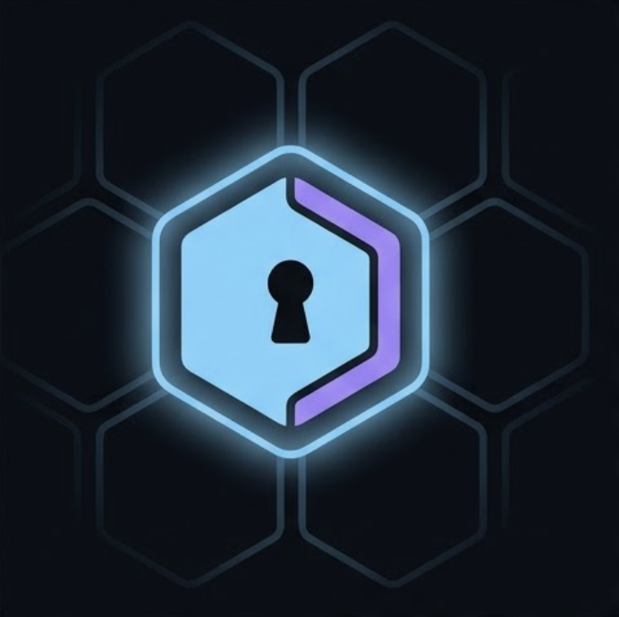

<p align="center">
  
</p>

<h1 align="center">Tessera</h1>

<p align="center">
  Short-lived, policy-gated API keys for AI agents. Local-first.
</p>

<p align="center">
  <a href="https://github.com/kovaron/tessera/actions"></a>
  <a href="LICENSE"></a>
  <a href="https://golang.org"></a>
  <a href="https://github.com/kovaron/tessera/releases"></a>
</p>

Tessera hands your AI agents an opaque, scoped subtoken (`pxy_*`) and swaps it for a real upstream API credential at request time. Live OPA policy evaluation, live secret resolution from 1Password / Doppler / env, instant revocation. No SaaS. No cloud. Your machine.

---

## The name

**Tessera** (plural _tesserae_) is the Latin word for a small mosaic tile.

In ancient Rome it was also the name for a token — a clay or bone tile bearing a mark or password that granted its bearer admission, hospitality, or a specific privilege. A _tessera hospitalis_ let a guest claim safe passage; a _tessera militaris_ relayed orders down a chain of command.

That maps cleanly to what this tool does:

- It mints **small, opaque tokens** scoped to a single upstream and bounded by a policy.
- Each token is **one piece of a larger picture** — the mosaic — composed by you, the admin, out of upstreams + policies + parent attenuations.
- The token itself is meaningless to anyone but the proxy; presenting it is what grants passage.

The hexagonal tile in the logo is a single tessera; the dimmer neighbours hint at the rest of the mosaic.

---

## Install

```bash
make build
```

Produces two binaries in the project root:

| Binary | Role |
|--------|------|
| `tessera` | Reverse-proxy daemon — handles agent HTTP traffic and admin socket |
| `tessera-cli` | CLI tool — manages keystore, upstreams, policies, and tokens |

Requires Go 1.22+. A macOS desktop UI (Tauri-based) is also available — see [Desktop UI](#desktop-ui) below.

---

## Quickstart

### 1. Initialize the keystore

```bash
./tessera-cli bootstrap
```

Prompts for a passphrase. Derives a key-encryption key (KEK) via Argon2id and writes an envelope-encrypted SQLite store to `~/.tessera/data.db`.

Alternatively, pass the passphrase non-interactively:

```bash
echo "mypassphrase" | ./tessera-cli bootstrap --passphrase-stdin
```

### 2. Start the proxy daemon

In a separate terminal:

```bash
./tessera
```

Listens on `http://127.0.0.1:8080` for agent traffic and exposes an admin socket at `~/.tessera/admin.sock` (mode 0600).

### 3. Unlock the keystore

```bash
./tessera-cli unlock
```

Prompts for the same passphrase. Decrypts the DEK and loads it into the running daemon via the admin socket.

### 4. Register an upstream

```bash
curl --unix-socket ~/.tessera/admin.sock -s \
  -X POST http://localhost/v1/upstreams \
  -H "Content-Type: application/json" \
  -d '{
    "id": "openai",
    "base_url": "https://api.openai.com",
    "inject": {
      "type": "bearer",
      "secret_ref": "env://OPENAI_API_KEY"
    }
  }'
```

### 5. Add a policy

```bash
./tessera-cli policy add --engine opa --file policy.rego --name read-only --upstream openai
```

Omit `--upstream` to create a global policy that any upstream can use. The same name can be reused across different upstreams.

Example `policy.rego` (Rego v1 syntax):

```rego
package proxy

default allow := false

allow if {
    input.token.upstream == input.request.upstream_id
    input.request.method == "POST"
}
```

The command prints the policy `<id>` — keep it for the next step.

### 6. Mint a subtoken

```bash
./tessera-cli token mint \
  --label ci \
  --upstream openai \
  --policy <id> \
  --ttl-seconds 3600
```

Prints a `pxy_*` token. Hand this to your agent — it never sees the real key.

### 7. Agent call

```bash
curl -H "Authorization: Bearer pxy_<token>" \
  http://127.0.0.1:8080/u/openai/v1/chat/completions \
  -d '{"model":"gpt-4o","messages":[{"role":"user","content":"hi"}]}'
```

The proxy:
1. Validates the subtoken (hash lookup + TTL check)
2. Evaluates the OPA policy against request context
3. Resolves the real `OPENAI_API_KEY` from the env provider (TTL-cached in memory)
4. Strips `Authorization` from the inbound request, injects the real credential, and forwards

---

## Transparent mode

Instead of constructing proxy URLs like `http://127.0.0.1:8080/u/openai/v1/chat/completions`, you can run your agent as a subprocess and let it talk directly to `https://api.openai.com`. Tessera intercepts via HTTP CONNECT, MITMs TLS using a locally-issued leaf cert, and routes by Host header.

```bash
./tessera-cli exec --upstream openai --policy <policy-id> -- python my_agent.py
```

The child process inherits `HTTPS_PROXY`, `*_CA_BUNDLE`, and `PXY_TOKEN` from the environment. When the process exits, the token is automatically revoked.

### Install the CA (one-time per machine)

```bash
./tessera-cli ca export > ~/.tessera/ca.pem
./tessera-cli ca install   # macOS: shells out to `security add-trusted-cert`
```

> **macOS only.** On other platforms, take `~/.tessera/ca.pem` and install it into your system trust store manually.

### Register hostnames

Either via the desktop UI (Upstreams screen → comma-separated Hostnames field) or the admin socket:

```bash
curl --unix-socket ~/.tessera/admin.sock -s -X POST http://localhost/v1/upstreams \
  -H "Content-Type: application/json" \
  -d '{
    "id": "openai",
    "base_url": "https://api.openai.com",
    "inject": { "type": "bearer", "secret_ref": "env://OPENAI_API_KEY" },
    "hostnames": ["api.openai.com"]
  }'
```

The `hostnames` field maps incoming `CONNECT` Host headers to an upstream. A request for an unregistered hostname is denied — there is no passthrough mode in v1.

### Run your agent under the proxy

```bash
./tessera-cli exec --upstream openai --policy <policy-id> -- python my_agent.py
```

All HTTPS traffic from the child process to `api.openai.com` is intercepted and policy-checked. Cert-pinned clients will fail the TLS handshake — that is intentional; the proxy must own the TLS session to inject credentials and evaluate policy.

The forward-proxy listener defaults to `127.0.0.1:8443`. Override with `--forward-addr` when starting the daemon.

---

## Desktop UI

A macOS admin app built with Tauri provides a graphical alternative to `tessera-cli`:

- Bootstrap wizard with Keychain integration (stores passphrase in macOS Keychain)
- Unlock / lock controls
- Upstream, policy, and token management
- Live audit log streaming

To build the sidecar binary first:

```bash
make sidecar
```

Then open the UI project with `pnpm tauri dev` from the `ui/` directory.

---

## Security model

### Subtokens

`pxy_*` tokens are 256-bit random strings. Only their SHA-256 hash is stored. A stolen subtoken is bounded by TTL and the OPA policy attached at mint time.

### Encryption at rest

The data-encryption key (DEK) is encrypted by a KEK derived from your passphrase using Argon2id (time=3, memory=64 MB). The DEK ciphertext is stored with XChaCha20-Poly1305 authenticated encryption. The passphrase never persists to disk.

### Credential handling

Upstream API credentials are never written to the keystore. They are resolved live from the configured provider on first use and cached in memory with a short TTL. A proxy restart clears the cache.

### Header stripping

`Authorization`, `Cookie`, and `Proxy-Authorization` headers from the agent request are always removed before forwarding upstream. Credentials are injected fresh from the resolved secret.

### Admin surface

The admin API is exposed only over a Unix domain socket (`~/.tessera/admin.sock`, mode 0600). Only the OS user who owns the socket can call it — no network exposure.

---

## Known limitations (v1)

- **Subset attenuation is admin-asserted** — there is no formal cryptographic subset proof; the `policy.subset_of` chain relies on the admin correctly scoping policies at mint time.
- **No rate limiting** — the proxy does not enforce per-token or per-upstream request quotas.
- **Single-node only** — no HA, clustering, or shared keystore support.
- **`parseInject` is a stub** — upstream registration via `tessera-cli` is not yet fully wired; use direct admin socket calls (see Quickstart step 4).
- **Config YAML loader exists but is not consumed** — `tessera` does not yet read its config file on startup; defaults are compiled in.
